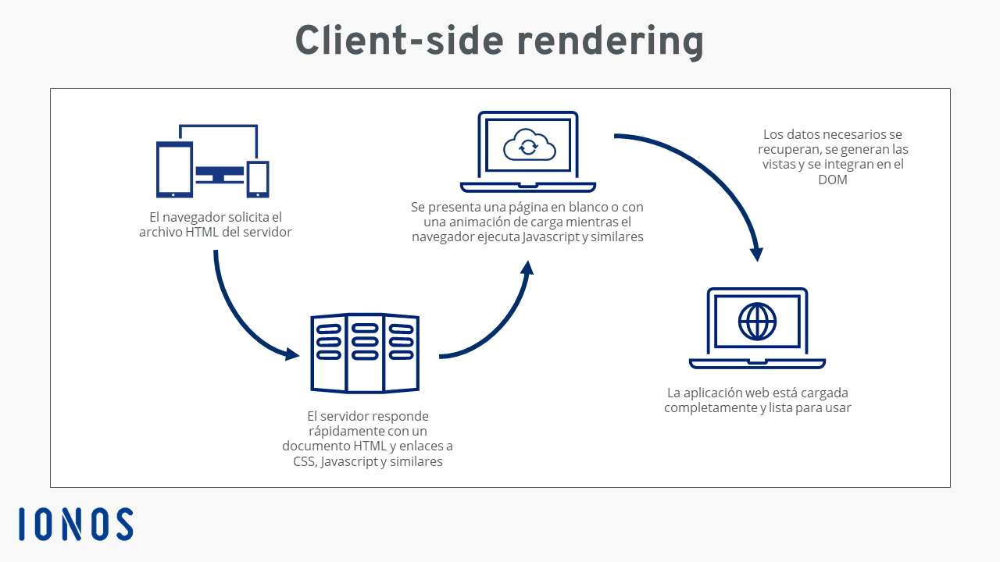

# Checkpoint 7- Bottega

## 1-¿Qué diferencia a JavaScript de cualquier otro lenguaje de programación?

Hay **4 puntos claves** que hacen que **JavaScript se diferencie entre los lenguajes de programacion.** \
\
A continuación te los expongo:

* **Lenguaje de programación del lado del cliente:** JavaScript es un lenguaje de programación del lado del cliente, lo que significa que se ejecuta en el navegador web del usuario. Esto permite que las páginas web sean interactivas y dinámicas, ya que JavaScript puede manipular el contenido de la página en respuesta a las acciones del usuario sin necesidad de comunicarse con el servidor constantemente.\
  
* **Interpretado y de tipado dinámico:** JavaScript es un lenguaje interpretado, lo que significa que el código se ejecuta línea por línea en lugar de compilar todo de una vez. Además, es un lenguaje de tipado dinámico, lo que permite declarar variables sin especificar su tipo de datos, ya que el tipo de dato se infiere en tiempo de ejecución.\
  .png>)
* **Sintaxis sencilla y flexible:** La sintaxis de JavaScript es relativamente sencilla y fácil de aprender para principiantes. Utiliza una notación similar a otros lenguajes como Java y C, pero con menos reglas y estructuras más flexibles. Por ejemplo, no es necesario declarar el tipo de datos de una variable al crearla.\
  .png>)\

*   **Utilizado para la interactividad en páginas web:** JavaScript se utiliza principalmente para mejorar la interactividad en páginas web. Puede utilizarse para validar formularios, crear efectos visuales, manipular el DOM (Document Object Model), realizar solicitudes a servidores (AJAX), y mucho más.

    .png>).png>)\


    #### ¿Por qué se utiliza JavaScript?

    * **Interactividad en el navegador:** JavaScript se utiliza para hacer que las páginas web sean interactivas y dinámicas. Puede manipular el contenido de la página, responder a eventos del usuario (como clics o desplazamientos), validar formularios, y más.

    <figure><figcaption></figcaption></figure>

    * **Mejora la experiencia del usuario:** Al permitir la interactividad en el navegador, JavaScript mejora la experiencia del usuario al proporcionar interfaces más ricas y atractivas.

    <figure><figcaption></figcaption></figure>

    * **Comunicación con el servidor:** JavaScript se utiliza para realizar solicitudes al servidor de forma asincrónica (AJAX), lo que permite actualizar partes de una página web sin necesidad de recargarla por completo.


    <figure><figcaption></figcaption></figure>

    * **Desarrollo de aplicaciones web:** JavaScript es fundamental en el desarrollo de aplicaciones web modernas, tanto en el frontend (cliente) como en el backend (servidor) con Node.js.

    <figure><figcaption></figcaption></figure>

    #### ¿Para qué se utiliza JavaScript?

    * **Manipulación del DOM:** JavaScript se utiliza para interactuar con el DOM (Document Object Model) de una página web, lo que permite agregar, modificar o eliminar elementos de la página en tiempo real.

    <figure><figcaption></figcaption></figure>

    * **Validación de formularios:** JavaScript se utiliza para validar los datos ingresados por los usuarios en formularios antes de enviarlos al servidor.

    <figure><figcaption></figcaption></figure>

    * **Animaciones y efectos visuales:** JavaScript se utiliza para crear animaciones y efectos visuales en páginas web, mejorando la presentación y la usabilidad.

    <figure><figcaption></figcaption></figure>

    * **Implementación de lógica de negocios:** JavaScript se utiliza para implementar la lógica de negocios de una aplicación web, como cálculos, procesamiento de datos, y más.

    <figure><figcaption></figcaption></figure>

    Sintaxis de JavaScript:

    * **Variables:** Se declaran con `var`, `let`, o `const`.

    <figure><figcaption></figcaption></figure>

    * **Funciones:** Se declaran con `function` o funciones flecha `() => {}`.

    <figure><figcaption></figcaption></figure>

    * **Condicionales:** Se utilizan `if`, `else if`, `else`.

    <figure><figcaption></figcaption></figure>

    * **Bucles:** Se utilizan `for`, `while`, `do-while`.

    <figure><figcaption></figcaption></figure>

    * **Objetos:** Se definen con llaves `{}` y propiedades separadas por comas.

    <figure><figcaption></figcaption></figure>

    * **Arrays:** Se definen con corchetes `[]` y pueden contener elementos de diferentes tipos.

    <figure><figcaption></figcaption></figure>

    #### Este es un ejemplo de una sintaxis en la que se utiliza un script de JavaScript en un HTML para hacer que al pulsar un boton te salga una alerta

    ```html
    <!DOCTYPE html>
    <html>
    <head>
      <title>Ejemplo de JavaScript</title>
    </head>
    <body>

    <h1>¡Hola, mundo!</h1>
    <p>Haz clic en el botón para ver un mensaje de alerta.</p>

    <button onclick="mostrarAlerta()">Haz clic aquí</button>

    <script>
    function mostrarAlerta() {
      alert("¡Has hecho clic en el botón!");
    }
    </script>

    </body>
    </html> 
    ```

## 2-¿Cuáles son algunos tipos de datos JS?

Algunos de los tipos de datos en JavaScript son estos:

1. **Número:** Representa valores numéricos, por ejemplo: `let numero = 10;`\
   .png>)
2. **String:** Representa texto, por ejemplo: `let texto = "Hola, mundo";`\
   .png>)
3. **Booleano:** Representa valores de verdadero (true) o falso (false), por ejemplo: `let esVerdadero = true;`\
   .png>)
4. **Objeto:** Representa un objeto con propiedades, por ejemplo: `let persona = { nombre: "Juan", edad: 30 };`\
   .png>)
5. **Array:** Representa una lista de elementos, por ejemplo: `let colores = ["rojo", "azul", "verde"];`\
   .png>)

Aqui dejo alguno de los ejemplos de los tipos de datos que hemos visto arriba:\


```javascript
let numero = 10;
let texto = "Hola, mundo";
let esVerdadero = true;
let persona = { nombre: "Juan", edad: 30 };
let colores = ["rojo", "azul", "verde"];

console.log(numero);
console.log(texto);
console.log(esVerdadero);
console.log(persona.nombre);
console.log(colores[0]);
```

## 3-¿Cuáles son las tres funciones de String en JS?

Las funciones de String son muy útiles para trabajar con cadenas de texto en JavaScript. Aquí te presento tres funciones comunes que puedes utilizar:

* **`length`:** Retorna la longitud de una cadena de texto.\
  .png>)\
  Ejemplo de su sintaxis:

```javascript
let texto = "¡Hola, mundo!";
console.log(texto.length); // Output: 12

```

*   **`toUpperCase()`:** Convierte una cadena de texto a mayúsculas.\
    .png>)\
    \
    Ejemplo de su sintaxis:\


    ```javascript
    let mensaje = "hola";
    console.log(mensaje.toUpperCase()); // Output: HOLA
    ```
*   **`indexOf()`:** Retorna la posición de la primera ocurrencia de un substring en una cadena.\
    .png>)\
    Ejemplo de su sintaxis:\


    ```
    let frase = "¡Hola, mundo!";
    console.log(frase.indexOf("mundo")); // Output: 7


    ```

## 4-¿Qué es un condicional?

1. **Toma de decisiones:** Los condicionales permiten que un programa decida qué instrucciones ejecutar en función de la evaluación de una condición.\
   .png>)
2. **Control de flujo:** Ayudan a controlar el flujo de ejecución de un programa, permitiendo ramificar el camino de ejecución en diferentes direcciones.\
   .png>)
3. **Personalización de la lógica:** Permiten personalizar la lógica de un programa para adaptarse a diferentes situaciones.\
   .png>)\
   .png>)

#### Utilidad de los condicionales:

Un condicional es una estructura de control fundamental en programación que permite tomar decisiones basadas en ciertas condiciones. Los condicionales permiten ejecutar diferentes bloques de código dependiendo de si una condición dada es verdadera o falsa. En esencia, los condicionales permiten que un programa tome decisiones dinámicamente durante su ejecución.

Tipos de condicionales comunes:

1. **`if`:** Se utiliza para ejecutar un bloque de código si una condición es verdadera.\
   .png>)
2. **`else if`:** Permite evaluar múltiples condiciones en secuencia.\
   .png>)
3. **`else`:** Se ejecuta si ninguna de las condiciones anteriores es verdadera.\
   .png>)
4. **`switch`:** Permite evaluar múltiples casos y ejecutar un bloque de código basado en el valor de una variable.\
   \
   .png>)

Los condicionales son esenciales en programación para implementar lógica condicional y tomar decisiones dinámicamente en un programa. ¡Espero que esta información te ayude a comprender el concepto de condicional de manera clara y concisa!\
\
Ejemplo de una condicional en JavaScript:\


```javascript
let edad = 18;

if (edad >= 18) {
    console.log("Eres mayor de edad. ¡Puedes votar!");
} else {
    console.log("Eres menor de edad. No puedes votar aún.");
}
```

En este ejemplo, el condicional `if` verifica si la variable `edad` es mayor o igual a 18. Si la condición se cumple, se ejecuta el primer bloque de código, y si no se cumple, se ejecuta el bloque de código dentro del `else`.\


## 5-¿Qué es un operador ternario?

El operador ternario es un operador condicional que permite escribir de manera concisa una declaración condicional en una sola línea. Se compone de tres partes: una expresión que se evalúa como verdadera o falsa, una expresión que se ejecuta si la condición es verdadera y otra expresión que se ejecuta si la condición es falsa.\
\
Los operadores ternarios son una herramienta poderosa en JavaScript para escribir condicionales de forma concisa y clara.\
\
.png>)

#### ¿Por qué se llama "operador ternario"?

El término "ternario" significa que este operador actúa sobre tres operandos, es decir, tiene tres partes que se evalúan en función de una condición.

#### Sintaxis del operador ternario:

La sintaxis general del operador ternario es la siguiente:

"condición ? expresión\_si\_verdadero : expresión\_si\_falso"

* La `condición` es una expresión que se evalúa como verdadera o falsa.
* La `expresión_si_verdadero` es el valor que se asigna si la condición es verdadera.
* La `expresión_si_falso` es el valor que se asigna si la condición es falsa.

#### ¿Por qué usar el operador ternario?

* **Sintaxis concisa:** Permite escribir condicionales de forma más compacta y legible en comparación con las estructuras `if...else`.
* **Claridad:** Ayuda a simplificar el código al reducir la cantidad de líneas necesarias para expresar una condición.
* **Eficiencia:** Al ser una expresión, el operador ternario puede ser utilizado en asignaciones de variables de manera directa.

\


Ejemplo de sintaxis de un operador ternario:\
En este ejemplo, la condición `(edad >= 18)` verifica si la edad es mayor o igual a 18. Si es verdadero, se asigna el mensaje "Eres mayor de edad" a la variable `mensaje`, de lo contrario se asigna "Eres menor de edad".

```javascript
let edad = 20;
let mensaje = (edad >= 18) ? "Eres mayor de edad" : "Eres menor de edad";
console.log(mensaje);
```

## 6-¿Cuál es la diferencia entre una declaración de función y una expresión de función?

En JavaScript, es fundamental comprender la diferencia entre una declaración de función y una expresión de función, ya que afecta la forma en que se define y se utiliza una función en tu código. A continuación, te proporciono información clara y comprensible, con ejemplos, sobre la diferencia entre estos dos conceptos para ayudarte a entender mejor cómo funcionan en JavaScript.\
\


#### ¿Por qué se utilizan las Declaraciones y Expresiones de Función en JavaScript?

* **Declaración de Función:** Se utiliza para definir una función en un contexto global o local antes de llamarla en el código. Puede ser invocada en cualquier parte del código, ya que se "eleva" al inicio del ámbito en el que se encuentra.
* **Expresión de Función:** Se utiliza para asignar una función a una variable u otro identificador. Normalmente se define en el lugar donde se necesita y no se "eleva" al inicio del ámbito, por lo que debe ser declarada antes de ser utilizada.\
  .png>)

#### Importancia de Declaraciones y Expresiones de Función para Principiantes:

* **Hoisting:** Las declaraciones de función se "elevan" al inicio del ámbito, permitiendo que se utilicen antes de su declaración.\
  .png>)
* **Flexibilidad:** Las expresiones de función son más versátiles y se pueden asignar dinámicamente a variables.
* **Organización del Código:** La elección entre declaración y expresión de función depende de cómo se planea utilizar la función en el código.\
  .png>)

Comprender la diferencia entre una declaración de función y una expresión de función es esencial para escribir código JavaScript claro y efectivo.

#### Sintaxis de Declaración y Expresión de Función en JavaScript:

**Declaración de Función:**\


```javascript
function saludar() {
  console.log("¡Hola, mundo!");
}
```

\
\
**Expresión de Función:**\


```javascript
const saludar = function() {
  console.log("¡Hola, mundo!");
};
```

\
\
Ejemplo de Declaración y Expresión de Función en JavaScript:\


```javascript
// Declaración de Función
saludar(); // Se puede llamar antes de la declaración
function saludar() {
    console.log("¡Hola, mundo!");
}

// Expresión de Función
despedirse(); // Error: despedirse is not a function
const despedirse = function() {
    console.log("¡Adiós, mundo!");
};
```

\
\


## 7-¿Qué es la palabra clave "this" en JS?

&#x20;La palabra clave `this` se refiere al objeto al que pertenece en un contexto determinado. El valor de `this` depende de cómo y dónde se utiliza dentro de una función o método. \
\
Puede resultar confuso para principiantes, pero es crucial para comprender cómo funcionan los objetos y métodos en el lenguaje.

¿Por qué es importante "this" en JavaScript?

* **Referencia dinámica:** Permite acceder y manipular propiedades de un objeto actual de forma dinámica.\
  .png>)
* **Contexto de ejecución:** Ayuda a entender en qué contexto se está ejecutando una función o método.\
  .png>)\
  .png>)
* **Orientado a objetos:** Facilita la programación orientada a objetos al referenciar propiedades y métodos de un objeto actual.\
  .png>)

#### Importancia de "this" en JavaScript para Principiantes:

* **Contexto dinámico:** Permite acceder dinámicamente a propiedades y métodos de un objeto en ejecución.
* **Evitar redundancia:** Facilita la reutilización de código al referenciar propiedades del objeto actual de forma dinámica.
* **Entender el comportamiento de los métodos:** Ayuda a comprender en qué contexto se están ejecutando los métodos y cómo interactúan con los objetos.

La palabra clave `this` es un concepto fundamental en JavaScript que juega un papel crucial en la manipulación de objetos y en la orientación a objetos.

#### Ejemplo de uso de "this" en JavaScript:

En este ejemplo, `this` se refiere al objeto `persona` cuando se usa dentro del método `saludar`. Permite acceder a las propiedades del objeto actual de manera dinámica.

```javascript
const persona = {
    nombre: "Juan",
    saludar: function() {
        console.log(`Hola, soy ${this.nombre}.`);
    }
};

persona.saludar(); // Imprime: Hola, soy Juan.
```

\


\


\


\


\


\


\


\


\


\
